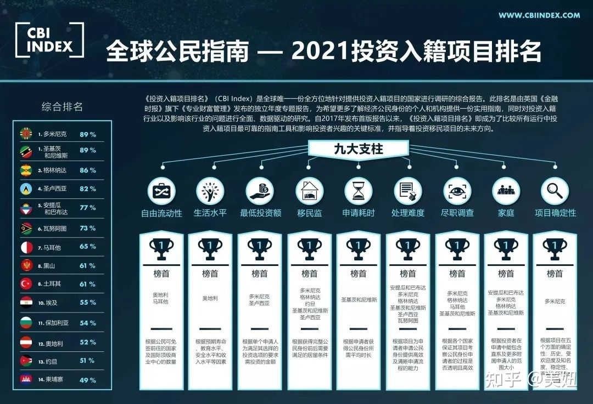
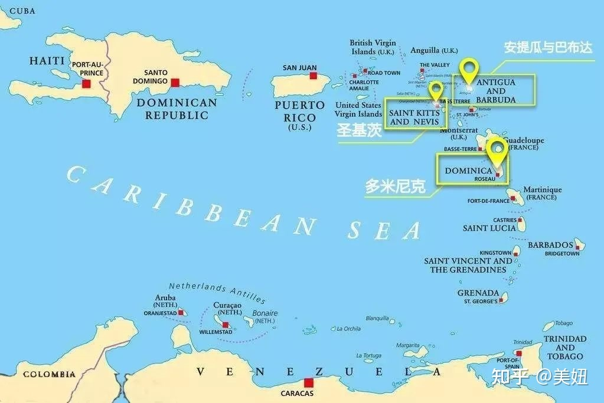
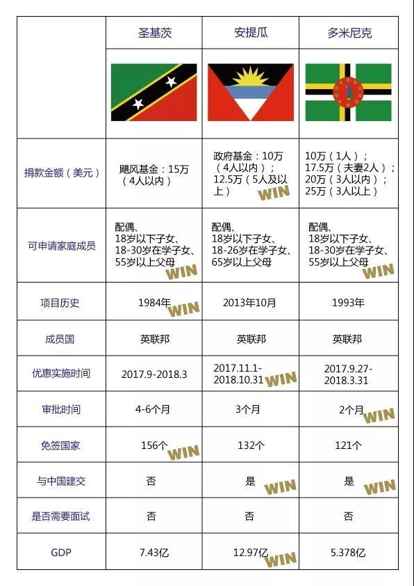

# 润的思考

对新加坡、加拿大、爱尔兰、新西兰等看了一圈，都没有找到一个很合适的国家来润。各有各的有点，各有各的缺点。

现在的想法是多找几个用于投资的国家拿到他们的永居或者护照，相当于多一个身份，到时候检测到风向不对可以润掉。

可以通过少量（100万RMB）的资产就可以拿到一些小岛国的护照：
多米尼克、圣基茨、Antigua、圣卢西亚、瓦努阿图、塞浦路斯等等
可以通过中等程度（350万RMB）的资产就可以拿到永居的有：
希腊、西班牙、马耳他、黑山共和国等等南欧国家

其他的一些参考资料备份如下：
> 圣基茨护照主要还是海外资产配置，与中国无建交，隐蔽安全性，很多商界大佬就办了这本护照可见而知；安提瓜优势在于便宜，一家三口最便宜，办本护照让小孩去做留学生比较性价比高，多米尼克优势在于一个人申请便宜，申请速度快。所以每个国家都有优势，看客户的需求点，这些加勒比海国家都能够免签上百个国家。

